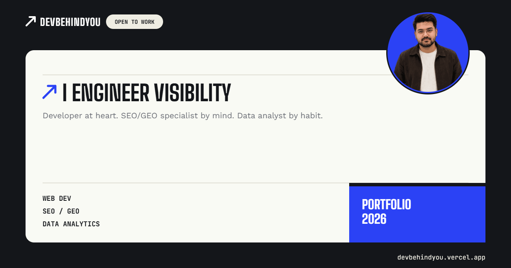

# 👋 Hey there, I'm DevBehindYou | I Engineer Visibility.

I don’t just write code; I build high-performance web solutions designed to be found. 

At the intersection of **Technical Execution** and **Strategic Growth**, I bridge the gap between building a product and ensuring it reaches the right audience.

### 💎 My Three Pillars of Growth
| **Development** | **SEO Engine** | **Data Driven** |
| :--- | :--- | :--- |
| Performance-First. Architecting high-speed, scalable web applications with technical SEO baked into the first line of code. | I engineer visibility. Moving beyond keywords to align technical structure with user intent and algorithms. | Insight-Led. I don't guess; I measure. Using analytics to validate what works and optimize for measurable business outcomes. |

 

 

---
### 🛠 My Tech Stack
- **Frontend & Core:** React, Next.js, WP, Flutter, Modern Web Frameworks.
- **SEO & Growth:** Technical SEO Audits, Programmatic SEO (pSEO), Screaming Frog, Schema Markup, Core Web Vitals Optimization.
- **Data & Analytics:** Python, Google BigQuery, Google Analytics 4, Search Console, Data Visualization & Interpretation: Tableau & PowerBI.

---

### 📈 Current Focus
- 🏗️ Building high-performance webapps & websites at **NinePages**.
- 🧪 Experimenting with **Programmatic SEO** architectures.
- ✍️ Sharing insights on the intersection of code and growth via **DevBehindYou**.

---
### 💡 Interactive Insights (Click to Expand)

  
<b>🕵️‍♂️ What exactly is "Programmatic SEO"?</b>

   
  It’s the science of scaling search visibility! Instead of writing one article at a time, I build scalable web architectures and use structured data to generate thousands of highly targeted, intent-driven landing pages dynamically.

  
<b>⚡ Why Next.js over traditional CMS?</b>

   
  Speed and control. Core Web Vitals are a direct ranking factor for Google. Next.js provides unmatched server-side rendering (SSR) and static site generation (SSG) capabilities, giving websites the millisecond load times they need to dominate search results.

  
<b>🛠️ Do you take freelance projects?</b>

   
  Yes! I selectively take on projects that need a blend of high-end web development and aggressive SEO architecture. You can reach out to me via the links below.

---
### 🤝 Let's Connect & Build Together
I'm always open to collaborating on projects that require a mix of technical precision and strategic growth.

* 📧 **Email:** [devbehindyou@gmail.com](mailto:devbehindyou@gmail.com)
* 🐦 **Twitter/X:** [@DevBehindYou](https://x.com/devbehindyou)
* 💼 **LinkedIn:** [@DevBehindYou](https://www.linkedin.com/in/devbehindyou/)
* 📝 **Medium:** [@DevBehindYou](https://medium.com/@devbehindyou/)

*"The old saying 'if you build it, they will come' is no longer true. I build it, and I make sure they arrive."*

 

